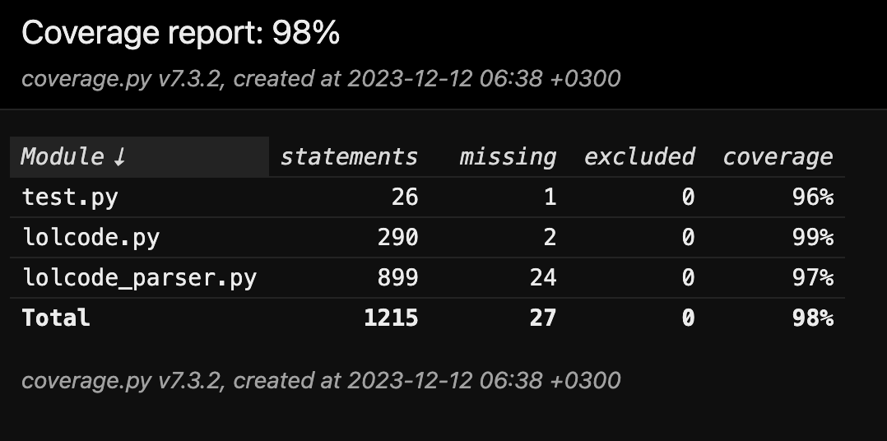

# lolcode interpreter

### requirements:
#### for running:
* python3 >= 3.10
#### for generating parser from grammar:
* python3 >= 3.10
* pegen
    ```
    python3 -m pip install pegen
    ```
#### for running tests:
* pytest
* coverage
    ```
    python3 -m pip install pytest coverage
    ```

### run ready-to-use interpreter:
1. Open text editor.
2. Put this example of lolcode:
    ```
    HAI 1.2
        VISIBLE "hello lolcode!"
    KTHXBYE
    ```
3. Save it, for example, as `example.lol`
4. Run with this command:
    ```
    python3 lolcode.py example.lol
    ```
5. Happy coding!
6. You can check an example in [first_primes.lol](./first_primes.lol)

### generate parser from the grammar:
1. run this command:
    ```
    python3 -m pegen lolcode.gram -qo lolcode_parser.py
    ```
### run tests:
    ```
    pytest ./test.py
    ```

### get coverage:
    ```
    coverage run --include=./lolcode.py,./lolcode_parser.py,./test.py  -m pytest test.py && coverage html
    coverage html
    ```

### coverage screenshot:
